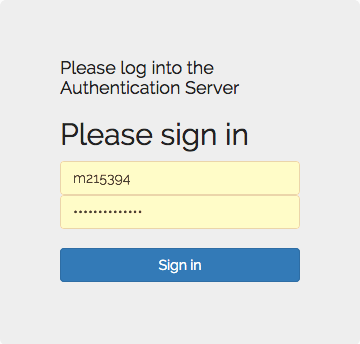
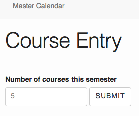
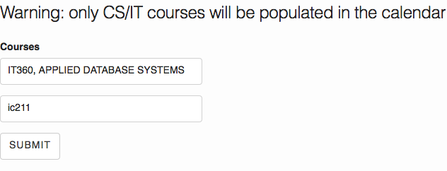
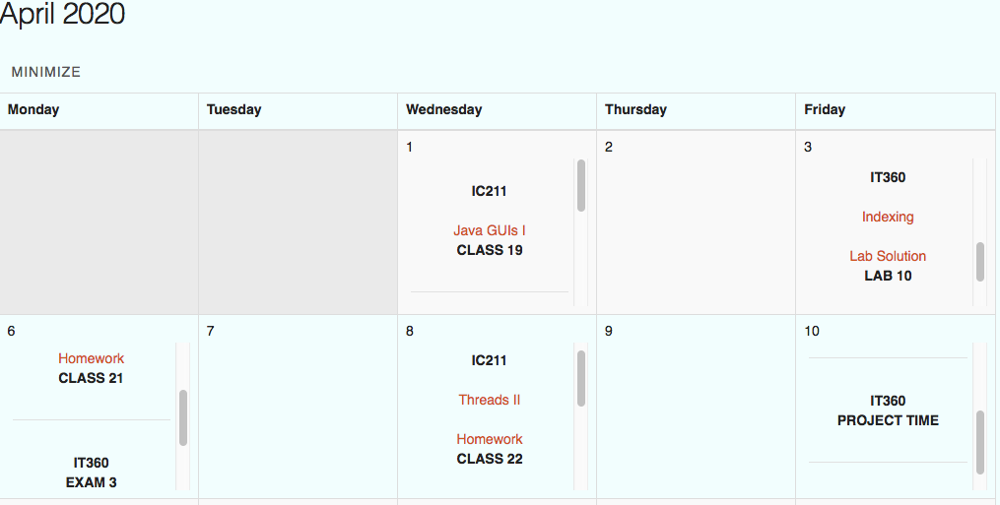

# Master Calendar

The following outlines both the technical and user stipulations of the *Master Calendar*, a website that consolidates course calendars for the CS/IT student at the United States Naval Academy.

Created by Samuel Kim, Jess Lonetti, and Gregory Polmatier.

## Contributors

A list of the team members involved in the project and their contributions is outlined below.

### Gregory Polmatier

Gregory was considered 'Team Lead' which involved managing deadlines for milestones and version control through *github*. In terms of code Gregory implemented the *insertAccess()* trigger that sets a default entry in our *auth_access* table upon an insert into the *auth_user* table. Finally, Gregory was responsible for the styling involved in the website to include both the bootstrap and css files. It should be noted that most of the bootstrap and css files are borrowed from the USNA course calendar template created by Jeff Kenney.

Files created/worked on:
* README.md
* triggers.sql
* home.php
* login.php
* bootstrap/css files integrated
* ProjectReport.md

### Samuel Kim

Samuel Kim's contribution was vital for the website functionality as he was mainly responsible for database creation and the login capability. Sam handled the create table statements as well the files that are required for the login function. Sam also developed the form that allows users to insert the courses students take upon logging in to the site for the first time. Finally, the website's functionality was mainly tested by Sam, by hosting the site on his account.

Files created/worked on:
* createTables.sql
* dropTables.sql
* generateData.sql
* Master Calendar ER Model.pdf
* auth.inc.php
* lib_authenticate.php
* login.php
* home.php
* courseForm.php
* insertStudentCourses.php
* insertCourseCodes.php

### Jess Lonetti

Jess Lonetti implemented the meat of the project in the form of the actual scraping of individual course websites and consolidating the information into usable tables to which we could display to the user. Jess also created our own implementation of the course calendar that would contain all of the student's information.

Files created/worked on:
* calander_creator.php
* calander_retiever.php
* calander.js
* courseinsert.php
* Daysnatcher.php

## Example Users

Our website is unique in the fact that we implemented USNA authentication. This means that anyone with academy credentials can access the website. Therefore, we do not have example users as that would require divulging real passwords.

## Technical Report

The following is a technical report outlining the functionality of the Master Calendar website from a code perspective.

### Database

The database for Master Calendar is a simple, SQL based format consisting of two types of tables, those that handle login capability and those that maintain calendar information.

* [The Entity Relationship model](tables/projectERModel.pdf)
* [createTables.sql](tables/sql/createTables.sql)

For login, there are three tables: auth_user, auth_session, and auth_access. The auth_user table maintains all of the base information for a recurring user that can be tracked. The auth_session table maintains session information for a user so that the system can remember session information as required. Finally, the auth_access table implements a hierarchy of users.   

To handle the calendar system there are an additional three tables: courseCode, student_courses, and assignments. The courseCode table keeps a list of CS/IT courses that use the official Calendar template that students could take. Next, the student_courses table keeps track of which courses students are taking that have signed up. Finally, the assignments table contains the assignments from each individual CS/IT calendar and their respective date.

#### Trigger

The database also contains a trigger. The trigger is labeled *insertAccess()* and its role in the database is to insert a default entry into the auth_access table upon an insert into the auth_user table. This allows every new user to automatically have a default entry in the auth_access table.

* [triggers.sql](tables/sql/triggers.sql)

### Login/User Management

Our website is unique in that we utilize the USNA login system in order to authenticate users. What this means is that instead of us maintaining passwords we decided to use the USNA system to handle it for us. Therefore in order to log onto the site a USNA account is required. The connection to the login system is facilitated in [lib_authenticate.php](login/lib_authenticate.php). Basically, when visiting the site you are taken to the [login.php](login/login.php) page which then redirects you to the USNA authentication if you choose to do so. The [lib_authenticate.php](login/lib_authenticate.php) page facilitates a connection with the server and provides us with useful information when returned to the site such as their name and alpha.

To maintain server side information like tracking whether a user is logged in using a session, the [auth.inc.php](login/auth.inc.php) is utilized. This script is included at the top of every webpage to verify the login status of a user. The script also contains all our functions that allow our session management with our database such as *logoff()*, *verify()*, and *signup()*.

### Student Course Forms

After a student logs in for the first time (or signs up) it is necessary for the website to know which CS/IT courses that student is currently taking. The forms themselves are located in the [courseForm.php](student_courses/courseForm.php) script. There are two forms, one form that requests how many CS/IT classes the student is taking and another which buildes off the first form that inputs the actual course codes. A generic list of possible USNA course entries can be selected. These courses are found in [courses.csv](courses/courses.csv). After the information has been submitted in the second form, a script called [insertStudentCourse.php](student_courses/insertStudentCourse.php) handles inputting the student associated information into the database in order maintain this particular student's courses and be able to display them in the calendar later.

### Stripping Course Websites

In order to create a Master Calendar we needed to create an algorithm that would allow us to strip each standard course website of its information to consolidate it in our database. The backbone of this system is the [Daysnatcher.php](Calendar_Taker/Daysnatcher.php) script which rips a standard CS/IT calendar into a comprehensible list. The [coursewebsite.php](Calendar_Taker/coursewebsite.php) script takes all the courses located at http://courses.cs.usna.edu/ and utilizes the *Daysnatcher()* function to get a list back from each website. Finally, with the information stripped from the websites the [courseinsert.php](Calendar_Taker/courseinsert.php) facilitates the functions necessary to enter the information for each assignment into the database.

### Making the Calendar

In order to display a consolidated calendar to users two things are required. First, the information for that student has to be retrieved from the database. Second, the actual Calendar has to be built. The first is handled by the [calendar_retriever.php](Calendar_Maker/calendar_retriever.php) script that retrieves the necessary calendar information from the database based on which classes that student takes. The second is solved using the [calendar_creator.php](Calendar_Maker/calendar_creator.php) script which generates the html in order to create the calendar. In order to dynamically use the calendar on the webpage [home.php](home.php) a JavaScript file is utilized called [calendar.js](Calendar_Maker/calendar.php) that combines the two files outlined above in order to display the calendar in a useful fashion.

## User Manuel

Next will be a comprehensible guide on how you can utilize the Master Calendar.

First, when attempting to access the site you will be prompted to log in. Once the log in link is clicked you will be brought to a USNA sign in page where you will enter your usna.edu information.

Next the new user will be prompted to enter how many CS/IT courses they would like to add to the Calendar. Then they will enter each class in the next form.

Finally, upon submitting those two forms you are brought to your Master Calendar which contains each assignment based on their day for all the CS/IT applicable classes you entered in the form.

There you have it! A simple, easy to use system. Hopefully this calendar saves you time by giving you a quick look at all your assignments in one place. Admittedly the website is limited in the number of courses that follow the required format for us to strip. However, we believe this is a stepping stone to a more consolidated calendar system for students that improves their quality of life and increases productivity. 
